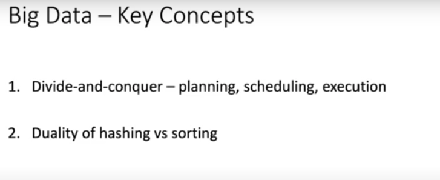
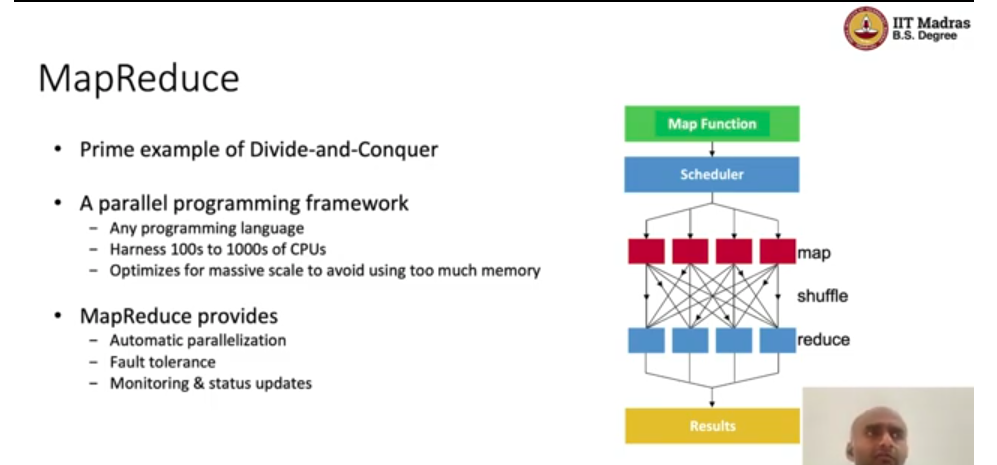

# L1.4 MapReduce

- https://youtu.be/fu5Me0poe5w

- planning  
    - how to break a problem into sub-problems, that can be solved in parallel
- scheduling
    - we cannot solve a problem in parallel, if we don't know how to schedule the sub-problems

- mapreduce did not optimize for memory, it optimized for being able to make progress

- map functtion
    - it is a function that takes an input and returns an output
- reduce function
    - counter part of map function
    - they take a list of outputs and return a single output
    - they aggregate the outputs

- we can have multiple levels of mapreduce