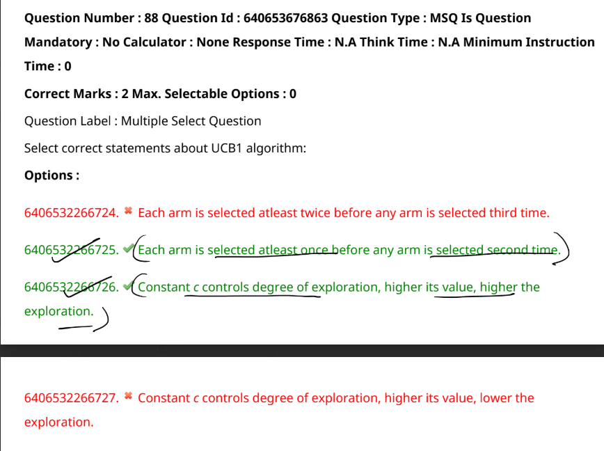

- UCB1 algorithm
    - Upper Confidence Bound algorithm
    - used to select the best action
    - it is a combination of exploration and exploitation
- https://www.youtube.com/watch?v=TIlDzLZPyhY

Let's analyze each option related to the UCB1 (Upper Confidence Bound) algorithm:

---

### 1. **Each arm is selected at least twice before any arm is selected a third time.**  
- **Explanation:** This statement is **incorrect**.  
  - In UCB1, each arm is selected once initially to gather a minimum amount of information. After that, the selection depends on the UCB value, which balances exploration and exploitation. There is no rule that forces each arm to be chosen twice before selecting any arm for the third time. It’s possible for the best-performing arm to be selected multiple times consecutively after the initial round.

---

### 2. **Each arm is selected at least once before any arm is selected a second time.**  
- **Explanation:** This statement is **correct.**  
  - UCB1 starts by selecting each arm once to initialize their reward estimates. This ensures that the algorithm has at least one reward sample for every arm, which is required to calculate the UCB value. After each arm has been selected once, the algorithm continues by choosing the arm with the highest UCB value.

---

### 3. **Constant c controls the degree of exploration; the higher its value, the higher the exploration.**  
- **Explanation:** This statement is **correct.**  
  - In UCB1, the UCB value is calculated using the formula:
    \[
    UCB = \text{Average reward} + c \times \sqrt{\frac{\log(n)}{n_j}}
    \]
    Where:
      - \( c \) is the exploration parameter.
      - \( n \) is the total number of trials.
      - \( n_j \) is the number of times arm \( j \) has been selected.
  - A higher value of \( c \) increases the influence of the exploration term, leading to more exploration. Conversely, a lower \( c \) encourages more exploitation (choosing the arm with the highest average reward).

---

### 4. **Constant c controls the degree of exploration; the higher its value, the lower the exploration.**  
- **Explanation:** This statement is **incorrect.**  
  - As explained above, a higher \( c \) value **increases** exploration. This option contradicts that principle. In fact, decreasing \( c \) would reduce exploration and lead the algorithm to exploit the arm with the highest observed reward more aggressively.

---

### **Summary of Correctness:**
- **Correct:** Option 2, Option 3
- **Incorrect:** Option 1, Option 4