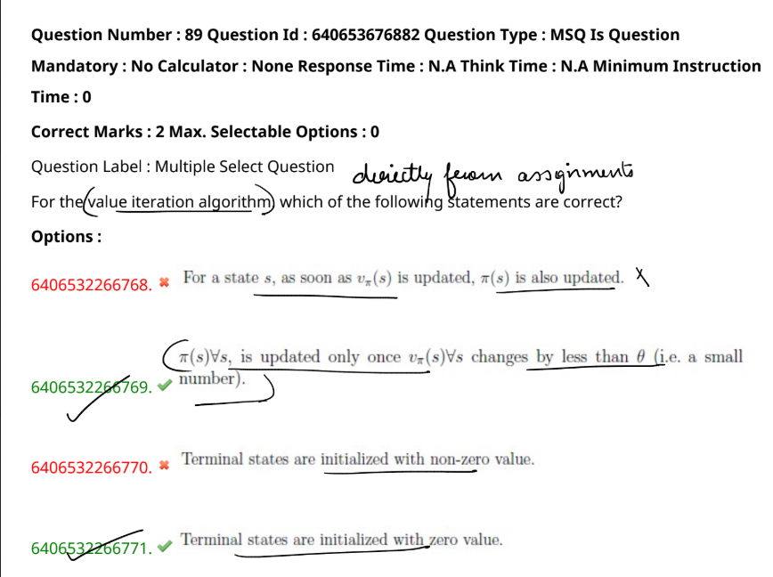

Value iteration is an algorithm used in **Reinforcement Learning** to find the best way for an agent (like a robot or a game character) to make decisions in an environment. It helps the agent figure out the best actions to take to get the most rewards over time. Here’s a simple explanation:  

---

### **What is Value Iteration?**  
Imagine you're playing a game where you move a character on a grid. Each cell on the grid can give you a reward (like points) or a penalty (like losing points). Your goal is to find the best path to get the highest score.  

**Value Iteration** helps you do this by calculating the *value* of each cell, which represents the maximum expected reward you can get starting from that cell. Once you know the values, you can decide the best move at each step.  

---

### **How Does It Work?**  
1. **Initialize Values:**  
   - Start by setting the value of each cell to zero (or some initial guess).
   - Terminal states (like the end of the game) are usually initialized with a value of zero because no more rewards are gained from them.

2. **Update Values Repeatedly:**  
   - For each cell, calculate the new value by considering:
     - The immediate reward of moving to a neighboring cell.
     - The value of the neighboring cell itself (because it leads to future rewards).
     - The probability of moving to each neighboring cell (e.g., you might not always move exactly where you want due to randomness).

   - The formula for updating the value of a state \( s \) is:  
     \[
     V(s) = \max_{a} \sum_{s'} P(s' | s, a) \left[ R(s, a, s') + \gamma V(s') \right]
     \]  
     Where:
     - \( V(s) \) = Value of state \( s \)
     - \( a \) = Possible action
     - \( s' \) = Next state after taking action \( a \)
     - \( P(s' | s, a) \) = Probability of reaching \( s' \) from \( s \) by taking action \( a \)
     - \( R(s, a, s') \) = Reward for taking action \( a \) and reaching state \( s' \)
     - \( \gamma \) = Discount factor, which determines the importance of future rewards

3. **Check for Convergence:**  
   - Keep updating the values until they stop changing significantly (i.e., the difference between old and new values is less than a small threshold \( \theta \)).  
   - This means the agent has learned the best value for each state.

4. **Extract the Policy:**  
   - Once the values are stable, the agent can decide the best action for each state by choosing the move that leads to the neighboring state with the highest value.
   - This set of best actions for all states is called the **policy**.

---

### **Why Use Value Iteration?**  
- It's simple to implement and guarantees to find the optimal policy if the environment is fully known.
- It's useful in grid-world scenarios, games, and other decision-making problems where the environment is predictable.

---

### **Example:**  
Let's say you’re in a 3x3 grid, and the bottom-right cell gives you +10 points (goal), but the middle cell gives you -5 points (trap). Using value iteration:  
- The goal state will eventually have a high value because it gives a reward.
- The trap will have a low (or negative) value because it gives a penalty.
- All other cells will have values depending on how close they are to the goal or trap.  
- The agent will learn to move towards the goal while avoiding the trap by updating the values and then choosing actions that maximize the rewards.

---

### **Summary:**  
- **Value Iteration** helps an agent learn the best way to act in an environment by calculating the value of each state.
- It updates these values repeatedly by considering possible actions, rewards, and probabilities.
- The result is a policy that tells the agent the best action to take in each state for maximum reward.  

It's like teaching a robot to navigate a maze by figuring out the most rewarding path while avoiding dead-ends or traps!

If you want to see a step-by-step example or the code for it, let me know!

# ---

Here’s an explanation for each option related to the value iteration algorithm:

1. **Option 6406532266768 (Incorrect):**  
   - *Statement:* "For a state \( s \), as soon as \( v_{\pi}(s) \) is updated, \( \pi(s) \) is also updated."
   - *Explanation:* In value iteration, the policy \( \pi(s) \) is not immediately updated when the value \( v(s) \) is updated. The value iteration algorithm first updates the value function for all states and then updates the policy once the value function has sufficiently converged. Therefore, this statement is incorrect.

2. **Option 6406532266769 (Correct):**  
   - *Statement:* "\( \pi(s), \forall s \), is updated only once \( v_{\pi}(s) \) changes by less than \( \theta \) (i.e., a small number)."
   - *Explanation:* This is accurate because, in value iteration, the policy is typically updated only when the value function changes very little (less than a small threshold \( \theta \)). This ensures that the policy is stable and that further value updates will not significantly affect the decision-making process.

3. **Option 6406532266770 (Incorrect):**  
   - *Statement:* "Terminal states are initialized with non-zero value."
   - *Explanation:* In value iteration, terminal states are typically initialized with zero value because they represent the end of the episode, and no future rewards are accumulated from them. Therefore, this statement is incorrect.

4. **Option 6406532266771 (Correct):**  
   - *Statement:* "Terminal states are initialized with zero value."
   - *Explanation:* This is correct as terminal states have no future rewards or decisions to be made. Initializing them with zero correctly represents their value in the context of dynamic programming and reinforcement learning.

If you need more clarification on any of these explanations, let me know!