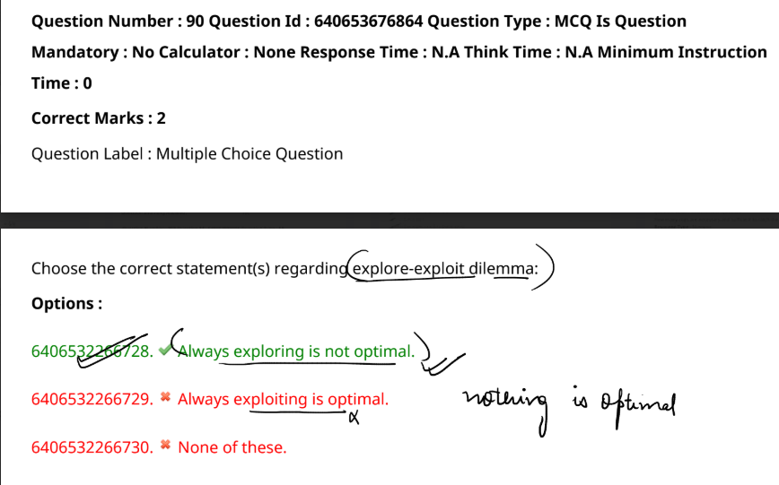

The correct statement is:  

**6406532266728. Always exploring is not optimal.**  

In the explore-exploit dilemma, **always exploring** (trying new actions without exploiting known rewards) is not optimal because it ignores the knowledge gained from previous experiences, potentially missing out on higher rewards. On the other hand, **always exploiting** (choosing the best-known option every time) can also be suboptimal because it may prevent discovering even better options. A balanced strategy that judiciously alternates between exploration and exploitation is generally more effective.