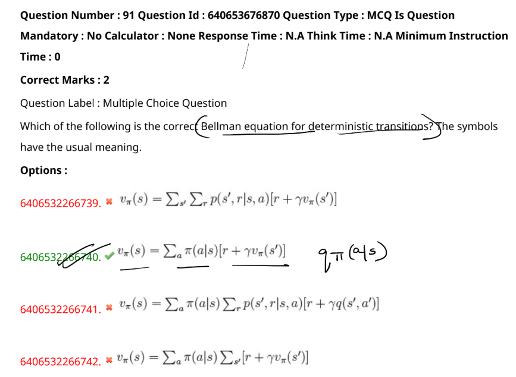

The question is about the Bellman equation for deterministic transitions. In deterministic transitions, the next state \( s' \) is fully determined by the current state \( s \) and action \( a \), so the transition probability \( p(s' | s, a) \) is 1 for the next state and 0 for all others.

The correct form of the Bellman equation for deterministic transitions is:
$$
v_\pi(s) = \sum_a \pi(a|s) \left[ r + \gamma v_\pi(s') \right]
$$

This equation states that the value of a state \( s \) under a policy \( \pi \) is the expected return obtained by taking action \( a \) in state \( s \), receiving the immediate reward \( r \), and then following policy \( \pi \) thereafter, discounted by \( \gamma \).

In the image, this corresponds to the second option, which is correctly marked as the answer.