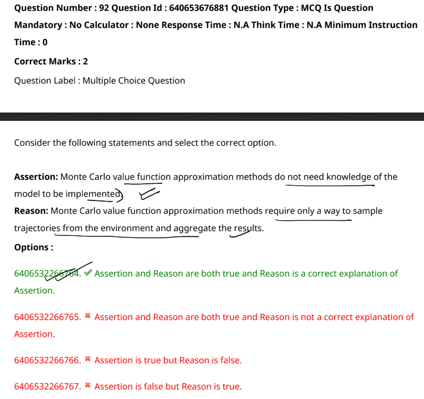

The correct option is:  

**6406532266764. Assertion and Reason are both true and Reason is a correct explanation of Assertion.**  

### Explanation:  
- **Assertion**: Monte Carlo value function approximation methods do not need knowledge of the model to be implemented.  
  - This is true because Monte Carlo methods estimate value functions based on observed trajectories without requiring a model of the environment's dynamics (i.e., the transition probabilities or reward function).  

- **Reason**: Monte Carlo value function approximation methods require only a way to sample trajectories from the environment and aggregate the results.  
  - This is also true because Monte Carlo methods rely on sampling episodes (sequences of states, actions, and rewards) to calculate returns and update value estimates. They aggregate these results over multiple episodes to approximate the value function.  

Since the Reason correctly explains why the Assertion is true, the first option is the best choice.