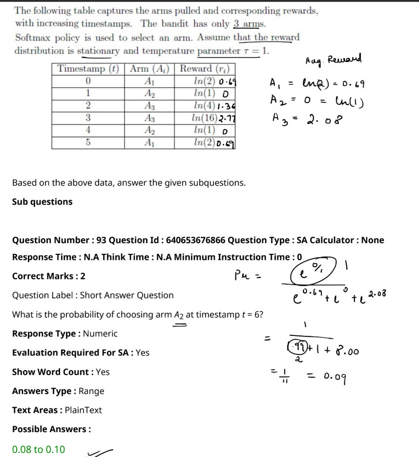

The value \( A_3 = 2.08 \) is calculated as the average reward for arm \( A_3 \) based on the logarithmic rewards given in the table. Here's how it is calculated:

### Step 1: Identify the Rewards for \( A_3 \)
From the table:
- At timestamp \( t = 2 \), \( A_3 \) was pulled, and the reward was \( \ln(4) \).
- At timestamp \( t = 3 \), \( A_3 \) was pulled again, and the reward was \( \ln(16) \).

### Step 2: Calculate the Individual Rewards
Using the natural logarithm values:
- \( \ln(4) = 1.39 \)
- \( \ln(16) = 2.77 \)

### Step 3: Calculate the Average Reward for \( A_3 \)
Since \( A_3 \) was pulled twice, the average reward is calculated as:
\[
A_3 = \frac{\ln(4) + \ln(16)}{2} = \frac{1.39 + 2.77}{2} = \frac{4.16}{2} = 2.08
\]

### Explanation
The average is calculated because the Softmax policy uses the mean reward obtained by each arm to compute the probability of choosing that arm. Here, the rewards from both pulls of \( A_3 \) are averaged, leading to the value \( A_3 = 2.08 \).

That's how \( A_3 = 2.08 \) is obtained!

From the given image, the problem involves calculating the probability of choosing arm \( A_2 \) at timestamp \( t = 6 \) using the Softmax policy with a temperature parameter \( \tau = 1 \). Here's how the calculation is done:

1. **Calculate Average Rewards**:

   - \( A_1 = \ln(2) = 0.69 \)
   - \( A_2 = 0 = \ln(1) \)
   - \( A_3 = 2.08 \)

2. **Softmax Probability Formula**:

   \[
   P_\mu = \frac{e^{r_i}}{\sum_{j} e^{r_j}}
   \]
   Where \( r_i \) is the average reward of the arm.

3. **Apply the Formula**:
   - \( P(A_2) = \frac{e^{0}}{e^{0.69} + e^{0} + e^{2.08}} \)
   - \( P(A_2) = \frac{1}{2 + 1 + 8} = \frac{1}{11} \approx 0.09 \)

4. **Result**:
   - The probability of choosing arm \( A_2 \) is approximately **0.09**, which falls within the range **0.08 to 0.10** as shown in the possible answers.

The solution correctly applies the Softmax policy and reaches the expected probability value.