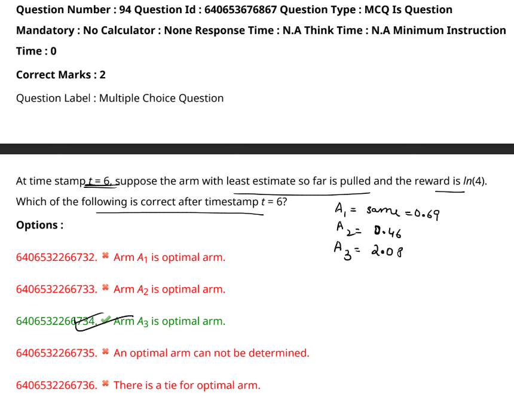

To determine the correct option, let's analyze the scenario step by step:

---

### Given:
- At timestamp \( t = 6 \), the arm with the least estimate so far is pulled, and the reward is \( \ln(4) \).
- From the previous calculations:
  - \( A_1 = \ln(2) = 0.69 \) (pulled once)
  - \( A_2 = 0 = \ln(1) \) (pulled once)
  - \( A_3 = 2.08 \) (average of \( \ln(4) \) and \( \ln(16) \))

---

### Step 1: Identify the Arm Pulled at \( t = 6 \)

Since the arm with the least estimate is pulled, and the estimates are:
- \( A_1 = 0.69 \)
- \( A_2 = 0 \)
- \( A_3 = 2.08 \)

The least estimate is for \( A_2 \). Therefore, **\( A_2 \) is pulled** at \( t = 6 \) and the reward is \( \ln(4) \).

---

### Step 2: Update the Estimate for \( A_2 \)

After pulling \( A_2 \) at \( t = 6 \), the average reward for \( A_2 \) is updated as:

$$
A_2 = \frac{\ln(1) + \ln(4)}{2} = \frac{0 + 1.39}{2} = 0.695
$$

---

### Step 3: Compare the Updated Estimates

After timestamp \( t = 6 \), the updated estimates are:
- \( A_1 = 0.69 \)
- \( A_2 = 0.695 \)
- \( A_3 = 2.08 \)

- \( A_3 \) has the highest estimate.
- \( A_1 \) and \( A_2 \) have nearly equal estimates, but \( A_2 \) is slightly higher.

---

### Step 4: Determine the Optimal Arm

The **optimal arm** is the one with the highest average reward, which is **\( A_3 \)**. 

Therefore, the correct option is:
- **6406532266734. Arm A3 is optimal arm.**

---

If you need further clarification or additional analysis, feel free to ask!