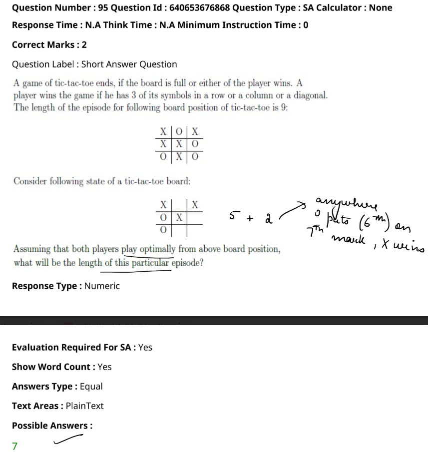

From the image, the problem is about calculating the length of a tic-tac-toe episode given an intermediate board state, assuming both players play optimally. Here's the analysis:

1. The board shows the current state with X and O marks.
2. X is one move away from winning.
3. If both players play optimally:
   - O will make a move, but X will eventually win on the next move.
   - The game will end in 2 more moves.
4. `The length of the episode is calculated as the total number of moves made by both players by the end of the game.`
5. The handwritten calculation shows 5 (current moves) + 2 (remaining moves) = 7.

Therefore, the length of the episode is 7, as marked under "Possible Answers" in the image.