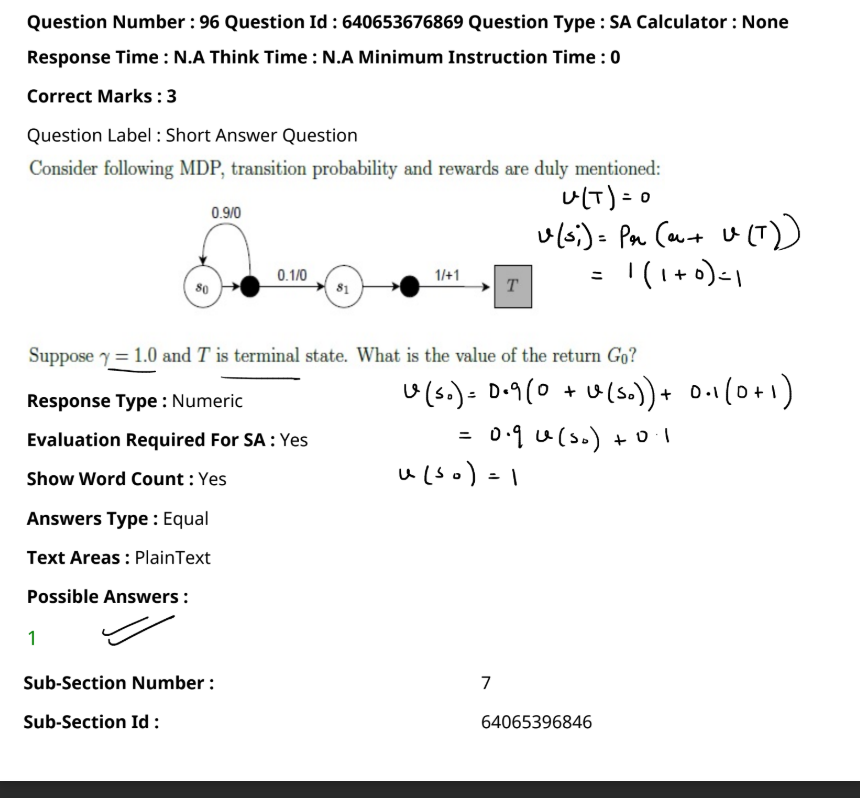

The image shows a Markov Decision Process (MDP) with transition probabilities and rewards. The problem involves calculating the value of the return \( G_0 \) given the following details:

- \( \gamma = 1.0 \) (discount factor)
- \( T \) is the terminal state with \( V(T) = 0 \)
- Transition probabilities and rewards:
  - From \( s_0 \) to \( s_0 \) with probability 0.9 and reward 0
  - From \( s_0 \) to \( s_1 \) with probability 0.1 and reward 0
  - From \( s_1 \) to \( T \) with probability 1 and reward 1

The value function is calculated as:
- \( V(T) = 0 \)
- \( V(s_1) = 1(1 + 0) = 1 \)
- \( V(s_0) = 0.9 (0 + V(s_0)) + 0.1 (0 + 1) \)
  - \( V(s_0) = 0.9 V(s_0) + 0.1 \)
  - \( V(s_0) = 1 \)

The value of the return \( G_0 \) is therefore **1**.